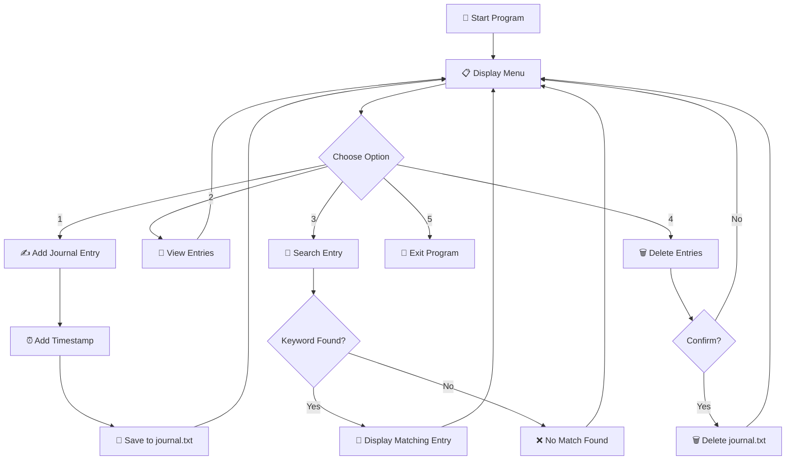
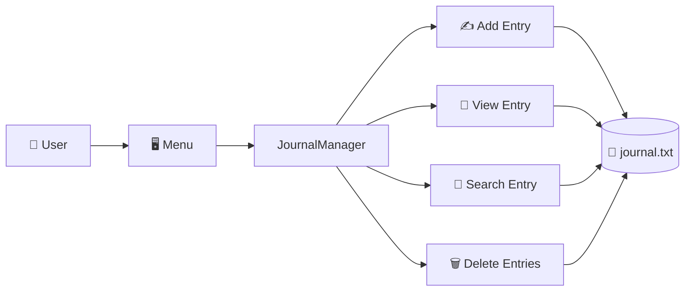

# file_operator
# 📔 Personal Journal Manager

<p align="center">

### ✨ A Simple, Secure & User-Friendly Python Journal Application ✨

**Write • Save • Search • View • Delete**

</p>

<p align="center">


</p>

---

## 🌟 About The Project

**Personal Journal Manager** is a simple command-line Python application that allows users to maintain their personal journal directly from the terminal.

The application lets you:

* ✍️ Add new journal entries
* 📖 View all saved entries
* 🔎 Search entries using keywords or dates
* 🗑️ Delete all journal entries
* ⏰ Automatically save the date and time of every entry
* 💾 Store journal data inside a simple `journal.txt` file

This project is designed especially for **Python beginners** who want to learn about:

> 🐍 Python Classes + File Handling + Exception Handling + Date & Time + User Input + Loops

---

# 🖼️ Project Preview

<p align="center">


</p>

> 💡 **Tip:** Replace the image above with an actual screenshot of your terminal after running the project.

---

# 🎯 Main Features

| Feature                | Description                              |
| ---------------------- | ---------------------------------------- |
| ✍️ **Add Entry**       | Write and save a new journal entry       |
| 📖 **View Entries**    | Display all saved journal entries        |
| 🔎 **Search**          | Search using keywords or dates           |
| 🗑️ **Delete**         | Delete all journal entries               |
| ⏰ **Timestamp**        | Automatically records date & time        |
| 💾 **File Storage**    | Stores data in `journal.txt`             |
| 🛡️ **Error Handling** | Handles invalid inputs and missing files |
| 🖥️ **CLI Interface**  | Simple terminal-based menu               |

---

# 🚀 How It Works



---

# 🧠 Concepts Used

### 🐍 Python Concepts

```text
Python
 │
 ├── Classes & Objects
 │
 ├── Functions / Methods
 │
 ├── Loops
 │
 ├── Conditional Statements
 │
 ├── Exception Handling
 │
 ├── File Handling
 │
 ├── User Input
 │
 ├── String Operations
 │
 ├── Date & Time
 │
 └── Operating System Module
```

---

# 🛠️ Technologies Used

### 🐍 Python

The entire application is written in Python.

### 📄 Text File Storage

Journal entries are stored inside:

```text
journal.txt
```

### ⏰ Datetime

Python's `datetime` module automatically records when an entry was created.

### 💻 OS Module

The `os` module is used to delete the journal file when the user chooses the delete option.

---

# 📂 Project Structure

```text
Personal-Journal-Manager/
│
├── 📄 journal_manager.py
├── 📄 journal.txt
└── 📄 README.md
```

### File Description

| File                 | Purpose                 |
| -------------------- | ----------------------- |
| `journal_manager.py` | Main Python application |
| `journal.txt`        | Stores journal entries  |
| `README.md`          | Project documentation   |

---

# 💻 Installation & Setup

## 1️⃣ Clone the Repository

```bash
git clone https://github.com/Krish-dahiya/Personal-Journal-Manager.git
```

## 2️⃣ Open the Project

```bash
cd Personal-Journal-Manager
```

## 3️⃣ Run the Program

```bash
python journal_manager.py
```

That's it! 🎉

---

# 📋 Application Menu

When the program starts, you will see:

```text
Welcome to Personal Journal Manager!
Please select an option.

1. Add a New Entry
2. View all Entries
3. Search for an Entry
4. Delete all Entries
5. Exit

user Input:
```

---

# ✍️ Adding a Journal Entry

Select:

```text
1
```

Then enter your journal entry.

### Example

```text
Enter your journal entry:
Today I learned Python file handling.

Entry added successfully.
```

The application automatically adds the date and time.

### Stored Data

```text
[2026-09-28 15:30:12] Today I learned Python file handling.
```

---

# 📖 Viewing Journal Entries

Select:

```text
2
```

Example:

```text
Your Journal Entries:
-------------------------------------

[2026-09-27 18:20:15] Started learning Python.
[2026-09-28 15:30:12] Today I learned file handling.
[2026-09-28 15:35:40] Completed my journal project.
```

---

# 🔎 Searching Entries

Select:

```text
3
```

Then enter a keyword or date.

### Example

```text
Enter keyword or date to search: Python
```

Output:

```text
[2026-09-28 15:30:12] Today I learned Python file handling.
```

The search is **case-insensitive**, so:

```text
python
Python
PYTHON
```

can all match the same entry.

---

# 🗑️ Deleting Entries

Select:

```text
4
```

The program asks for confirmation:

```text
Are you sure you want to delete all entries? (yes/no):
```

If you enter:

```text
yes
```

all journal entries are deleted.

If you enter:

```text
no
```

the deletion is cancelled.

---

# 📊 Feature Overview

```text
Add Entry       ████████████████████ 100%
View Entries    ████████████████████ 100%
Search          ████████████████████ 100%
Delete          ████████████████████ 100%
Timestamp       ████████████████████ 100%
Error Handling  ████████████████████ 100%
```

---

# 🧩 Program Architecture



---

# 🔐 Data Storage

The project uses a simple text file instead of a database.

### Example `journal.txt`

```text
[2026-09-26 10:15:22] Started my Python journey.
[2026-09-27 14:30:11] Learned about classes.
[2026-09-28 15:30:12] Created my first journal manager.
```

### Why TXT?

✅ Easy to understand
✅ No database setup required
✅ Beginner-friendly
✅ Lightweight
✅ Easy to inspect manually

---

# ⚠️ Error Handling

The application handles several common errors.

### Missing Journal File

```text
Journal file does not exist.
```

### Invalid Menu Input

```text
Invalid input. Please enter a number.
```

### Invalid Menu Option

```text
Invalid option. Please select a valid option from the menu.
```

### Delete Error

```text
Error while deleting file.
```

This makes the application more reliable and user-friendly.

---

# 🧪 Example Session

```text
Welcome to Personal Journal Manager!
Please select an option.

1. Add a New Entry
2. View all Entries
3. Search for an Entry
4. Delete all Entries
5. Exit

user Input: 1

Enter your journal entry:
Today I completed my Python project.

Entry added successfully.


1. Add a New Entry
2. View all Entries
3. Search for an Entry
4. Delete all Entries
5. Exit

user Input: 2

Your Journal Entries:
-------------------------------------
[2026-09-28 15:30:12] Today I completed my Python project.
```

---

# 📸 Screenshots

## 🖥️ Main Menu

<p align="center">


</p>

---

## ✍️ Add Entry

<p align="center">


</p>

---

## 📖 View Entries

<p align="center">


</p>

---

## 🔎 Search Entry

<p align="center">


</p>

> 📌 **Replace these placeholder images with screenshots from your own project for a more professional GitHub page.**

---

# 🌱 Future Improvements

This project can be upgraded with many exciting features.

### 🔮 Possible Future Features

* 🔐 Password protection
* 🗄️ SQLite database
* 🎨 Graphical User Interface
* 🌙 Dark mode
* 📅 Calendar-based journal
* 📤 Export entries to PDF
* ☁️ Cloud backup
* 🧠 Mood tracking
* 😊 Emoji support
* 🏷️ Categories and tags
* 📊 Journal statistics
* 🔍 Advanced search
* 📱 Web version

---

# 📈 Future Project Roadmap

```text
Version 1.0
   │
   ├── ✅ Add entries
   ├── ✅ View entries
   ├── ✅ Search entries
   ├── ✅ Delete entries
   └── ✅ Timestamp
          │
          ▼
Version 2.0
   │
   ├── 🔐 Password protection
   ├── 🏷️ Categories
   ├── 📊 Statistics
   └── 📅 Calendar
          │
          ▼
Version 3.0
   │
   ├── 🖥️ GUI
   ├── 🗄️ Database
   ├── ☁️ Cloud backup
   └── 📱 Web application
```

---

# 🎓 Learning Outcomes

By creating this project, you can practice:

```text
✅ Object-Oriented Programming
✅ File Handling
✅ Exception Handling
✅ Python Functions
✅ Loops
✅ Conditional Logic
✅ User Input
✅ String Searching
✅ Date & Time
✅ Basic Project Structure
```

This makes the project a great **beginner Python portfolio project**.

---

# ⭐ Why This Project?

Personal Journal Manager is a small project, but it demonstrates several important Python programming concepts in one application.

It is especially useful for students who are learning:

> **Python → OOP → File Handling → Real-World Projects**

---

# 👨‍💻 Author

<p align="center">

### **KRISH KUMAR PRAJAPAT**

🐍 Python Developer | 📊 Data Science Student | 💻 Programmer

</p>

### Skills

```text
Python • Java • React • SQL • C • GitHub
```

📧 **Email:** `krishofficial701@gmail.com`

🐙 **GitHub:** `Krish-dahiya`

---

# ⭐ Support

If you found this project useful:

### ⭐ Star this repository

### 🍴 Fork the repository

### 💻 Try the project

### 📢 Share it with other Python learners

---

<p align="center">

## 📔 Write Your Thoughts. Save Your Memories. 💙

### Made with ❤️ and Python 🐍

</p>

---

<p align="center">

**© 2026 Krish Kumar Prajapat**

</p>
